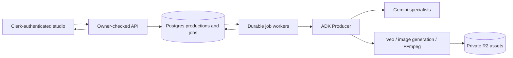

# BrainStudios

A conversational AI production team with one workflow:

**Prompt → Timed Script → Scene Plan → Generated Scenes → Video Assembly → Thumbnail → Publishing Details**

The existing production studio now connects to real services. Signed-in productions are stored in Postgres and owned by their Clerk user. The nature sample remains an explicitly labeled, browser-local fallback.

## Run locally

Use Node 22+ and pnpm. Configure the root `.env` using `.env.example`; never prefix server secrets with `VITE_`.

```sh
pnpm install --frozen-lockfile
pnpm --filter @workspace/api-server db:migrate
pnpm --filter @workspace/api-server dev
# In another terminal:
pnpm --filter @workspace/brainstudios dev
```

Open http://localhost:5173. Vite proxies `/api` to the API on port 5001. `API_PORT` changes the backend port; set `API_ORIGIN` when launching Vite if using another API port. `APP_ORIGINS` must include the frontend origin for Clerk token and CORS checks. In deployment, route `/api` to the Express server on the same origin.

The migration is additive and repeatable. It creates only `video_productions`, `video_jobs`, and `video_events`; it does not delete or change legacy production data. Use `db:migrate`, not a destructive schema push.

Google authentication uses **Application Default Credentials**. On a new local machine:

```sh
gcloud auth application-default login
gcloud auth application-default set-quota-project YOUR_PROJECT
```

Enable `aiplatform.googleapis.com`, billing, and permission to invoke the configured models. No `GOOGLE_APPLICATION_CREDENTIALS` file is required when local ADC is already configured. Model IDs and regions are configurable. Blank model values use the defaults in `.env.example`.

R2 needs object read/write permissions for the configured bucket. Assets remain private and are served through expiring signed URLs. The bundled FFmpeg binary handles encoding and media inspection; `FFMPEG_PATH` can override it. If package installation skipped the binary download, run `node node_modules/ffmpeg-static/install.js` from `artifacts/api-server`, or provide an installed encoder.

## Try a real production

1. Sign in, select **New video**, and describe the video, duration, format, and style.
2. The Producer delegates to the Script Writer. Review timestamped narration and edit individual sections.
3. **Approve script** delegates to the Scene Director. Each shot receives subjects, action, environment, camera movement, continuity, and a self-contained Veo prompt.
4. **Generate scenes** submits independent Veo operations. Ready clips are preserved while other clips wait or retry. Open a scene to review the actual clip, change its direction, or regenerate just that scene.
5. **Assemble video** normalizes and concatenates clips in timeline order into an H.264/AAC MP4, then saves it to R2.
6. Generate three actual thumbnail options, select a cover, and continue to publishing details. Editing the headline requires regenerating covers.
7. Review the Gemini-generated title, description, and tags. Use **Save changes** for edits, finish the production, and download the video, selected thumbnail, or JSON production package. Nothing is uploaded to YouTube.

The video uses Veo's generated ambience. The timed narration is included in the transcript and package; a spoken voiceover and burned-in captions are not added. This keeps the first real video pipeline dependable without adding another audio service.

## Agent orchestration and durability

The server uses Google's **ADK** `BaseAgent`, `LlmAgent`, and `InMemoryRunner`. A custom Producer delegates each approved durable job through ADK to a specialist. Script Writer, Scene Director, Thumbnail Creator, Publishing Assistant, and conversational Producer responses use Gemini with structured output. Visual Generator, Editor, and Thumbnail Renderer are ADK capability agents around Veo, FFmpeg, and image generation. Actual delegation/results are recorded in `video_events`.



ADK runs a bounded invocation per checkpoint. Postgres owns the durable production state, job queue, provider operation IDs, revisions, and event history; an in-memory agent session is never required to restore a production. Stage changes come from validated results, not generated claims.

- Workers claim jobs with `FOR UPDATE SKIP LOCKED`, renew leases, and fence writes with a unique claim token. Expired leases are recoverable after two minutes.
- Veo operation IDs are saved before polling. Poll intervals increase from 20 to 60 seconds. Reloads and restarts resume the same provider operation.
- Retryable failures back off, with at most four automatic attempts. Failed or paused jobs can be explicitly retried. An ambiguous Veo submission is not automatically resubmitted, avoiding accidental duplicate generation charges.
- Pause stops queued work and later polls. An already submitted operation cannot necessarily be cancelled at the provider; a completed result is kept.
- Editing a scene increments only its revision and invalidates its visual plan/clip plus dependent assembly, thumbnails, and publishing details. Unrelated ready clips remain intact. Old media is retained, labeled outdated, and replaced only after successful regeneration.
- Assembly and thumbnail retries reuse saved source clips and completed thumbnail options. Source media is not stored in the database.
- Production creation uses a per-user request ID for deduplication. Edits use optimistic versions to prevent another tab silently overwriting changes.
- API access, event history, and download links all check ownership. Server secrets stay on the server; only the Clerk publishable key reaches the frontend.

The API process runs two workers by default. `VIDEO_WORKER=false` serves only the API, useful for isolated tests. A running API/worker process is required for progress; browser tabs need not remain open.

## Checks

```sh
pnpm typecheck
pnpm --filter @workspace/api-server build
pnpm --filter @workspace/brainstudios build
# Uses temporary DB/R2 fixtures, then removes them; no AI generation:
pnpm --filter @workspace/api-server check:workflow
# Opt-in paid integration test: one 8-second clip and three covers:
pnpm --filter @workspace/api-server check:live
```

`CHECK_PRODUCTION_ID` resumes an earlier live check without recreating completed stages. Run the live-check harness with background workers disabled so the two runners do not claim the same check jobs. Live checks use their own owner ID and never impersonate an application user.

Verified locally: real ADC Gemini scripting/direction, Veo generation, R2 persistence, an 8.02-second encoded video with audio, three generated covers, publishing metadata, Clerk token authentication, API ownership and idempotency, concurrent job deduplication, stale-worker fencing, isolated invalidation, and mixed-audio portrait assembly. Browser checks cover the preserved sample and account workflow. Actual provider generation times and quotas still apply.

## Main code

- `artifacts/brainstudios/src/pages/Studio.tsx` — preserved conversation, canvas, responsive views, editing, real job progress, and output controls.
- `artifacts/brainstudios/src/components/ProductionApi.tsx` — Clerk-authenticated requests, account-scoped cache, and bounded polling.
- `artifacts/brainstudios/src/lib/production.ts` — the reliable local sample and mock-only behavior.
- `lib/video-workflow/src/index.ts` — shared contracts, exact timelines, and invalidation rules.
- `artifacts/api-server/src/video/` — owner-checked routes, ADK agents, durable workers, R2, and FFmpeg.
- `lib/db/migrations/0001_video_workflow.sql` — additive workflow schema.

The previous movie UI was removed. Its old API router is unmounted; retained authentication, database infrastructure, dependencies, and reusable UI components support the new workflow. Sample photography attribution is in `artifacts/brainstudios/public/images/SOURCES.md`.
